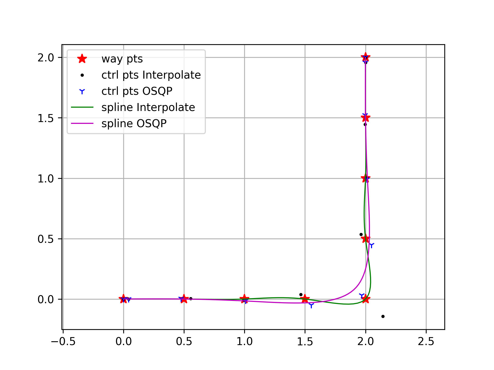

# Uniform Clamped Cubic BSpline 拟合曲线
## 基础知识

B-spline 曲线可以由控制点 $\mathbf{P}_i$ 和 基函数 $N_{i,p}(u)$ 的线性组合表示：

$$C(t) = \sum_{i=0}^{n}  N_{i, p}(u) \mathbf{P}_i$$

其中，基函数 $N_{i, p}(u)$ 是自变量为 $u$ 的 $p$ 次多项式：

$$
\begin{aligned}
N_{i, 0}(u) &= \left\{ \begin{matrix}  1\ &\mathtt{if}\ u_i \le u \lt u_{i+1} \\  0 & \mathtt{otherwise} \end{matrix} \right . \\
N_{i, p}(u) &= \frac{u - u_i}{u_{i+p} - u_i} N_{i, p-1}(u) + \frac{u_{i+p+1} - u}{u_{i+p+1} - u_{i+1}} N_{i+1, p-1}(u)
\end{aligned}
$$

|符号|描述|
|:--:|:--|
|$\mathtt{k}$ | order, $\mathtt{k=p+1}$|
|$\mathtt{p}$ | degree, cubic ($\mathtt{p}=3$)|
|$\mathtt{n}$ | $\mathtt{n+1}$ 个控制点|
|$\mathtt{m}$ | $\mathtt{m=n+p+1}$； knot vector 长度：$\mathtt{m+1}$|
|**clamped knots**| $\mathtt{u_0 = u_1 =... = u_p, u_{p+1},..., u_{m-p}=u_{m-p+1}=...=u_{m}}$|
| Segment | $\mathtt{m-2p = n-p+1}$ 个曲线段 |
|局部支撑| 控制点 $P_i$ 对应的支撑范围 $\mathtt{\left[u_i, u_{i+p+1}\right)}$|
|凸包|需要注意，局部支撑控制点对应的凸包并不是将控制点依次连接，而是通过凸包算法计算得到|

### 微分

- BSpline 曲线的导数为 $degree=p-1$ 的 BSpline 曲线
    - 导数 knots, 移除原始 knots 头尾两个值
    - 导数控制点 $\mathtt{Q_0, Q_1,...,Q_{n-1}}$

$$
\begin{aligned}
\frac{d}{du} C(u) &= C'(u) = \sum^{n-1}_{i=0}N_{i+1,p-1}(u) Q_i \\
&其中，Q_i=\frac{p}{u_{i+p+1}-u_{i+1}} (P_{i+1}-P_i)
\end{aligned}
$$

## 拟合曲线

对于路径规划场景，由于 vehicle 运行的转弯半径受限，通常对规划的路径曲率有一定限制。所以在对路径重新拟合时，根据曲率给定采样间隔可以保证路径的保形和精度。【 *香农采样* 】

### 插值

给定 $k+1$ 个数据点 $\mathtt{D_0, D_1, ..., D_k}$
- 添加两个端点处的切线条件 $k+1+2$
- knots_inner 对应数据点 $k+1$ 个
- knots 需添加两端钳位条件 2p 个，即 $k+1+2p$ 个
- 计算 basis matrix [k+1, k+1+2], 对应每个数据点对应的 $N_{i,p}(u)$
- 计算两端点导数对应系数（$u=0, u=1$）
    - knots 去掉收尾两点，$degree=p-1$，计算 vel basis matrix [k+1, k+1+2-1]
    - 计算导数控制点转换矩阵 Q2P[k+1+2-1, k+1+2]
- $D = N \cdot P$ ，此处 N 为方阵
- 解 $P = N^{-1} \cdot D$，得到参考**控制点**

### 平滑

以控制点决策变量，构建二次型目标函数，求解 QP 问题。

OSQP 的基本形式

$$
\begin{split}\begin{array}{ll}
  \mathtt{minimize} & \frac{1}{2} x^T P x + q^T x \\
  \mathtt{s. t.} & l \leq A x \leq u
\end{array}\end{split}
$$

#### 代价

##### 平滑代价

控制点的平滑性与样条曲线的平滑性正相关，所以，参考Apollo `FemPosSmooth` 计算控制点的平滑代价：

$$
\sum{ ||2P_k - P_{k-1} - P_{k+1}||_2^2 }
$$

##### 偏差代价

knots_inner 对应位置与原始数据点的偏差

$$
\sum ||C(k) - D_k||^2_2
$$

#### 约束

##### 控制点优化 Box

以采样间隔长度设定优化范围

$$
x_i - \Delta \leq x_i \leq x_i + \Delta
$$

##### 启发式半平面约束

由于平滑代价的引入，对于转弯路段的拟合，会导致轨迹向外凸出。（如图左下）

**半平面约束**：

已知数据点的位置 $D_k$ 和切线 $Dir$ 方向，根据启发式方法判断法线 $\mathbf{n}$ 约束方向。切线将当前点的优化空间分割为两个半空间，选择其中一个作为约束条件。

- 通过航点连线之间的夹角，找到剧烈转折点（e.g. $[2.0, 0.0]$）
- 在转折点前后各两点，添加半平面约束；从而消除为平滑剧烈转折引起的过大弧度

$$
\mathbf{n^T q + d > 0}
$$

|插值与优化| 加入半平面约束|
|:--:|:--:|
|| 

## 总结
 通常在 Planning 场景中，使用 BSpline 一般采用时间为自变量，在优化时以最小化 Jerk 为目标。

 但是在工程使用中，一般会使轨迹的路线和速度产生不必要的波动；大部分使用场景中，我们对整体的速度和时间并没有特别极限的要求。反而在 CNC 场景中，这种波动会引起加工零件的精度下降以及粗糙度变化。

 因此，我们采取弧长参数化方式，首先对路径的形状进行拟合，保证形状满足一般实施人员审美的基础上再进行速度规划。

## 参考资料
- https://pages.mtu.edu/~shene/COURSES/cs3621/NOTES/spline/B-spline/bspline-curve.html
- https://web.mit.edu/hyperbook/Patrikalakis-Maekawa-Cho/node17.html
- https://web.eecs.umich.edu/~sugih/courses/eecs487/lectures/37-B-splines+NURBS.pdf