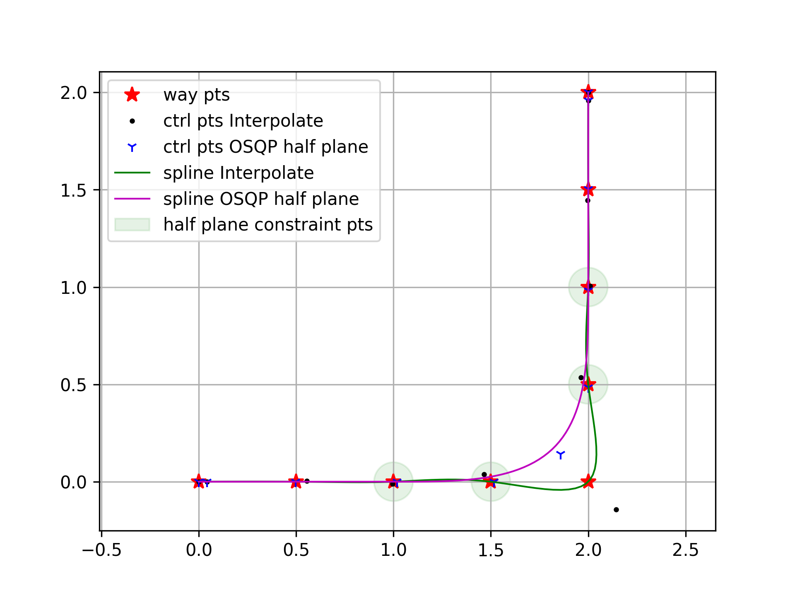
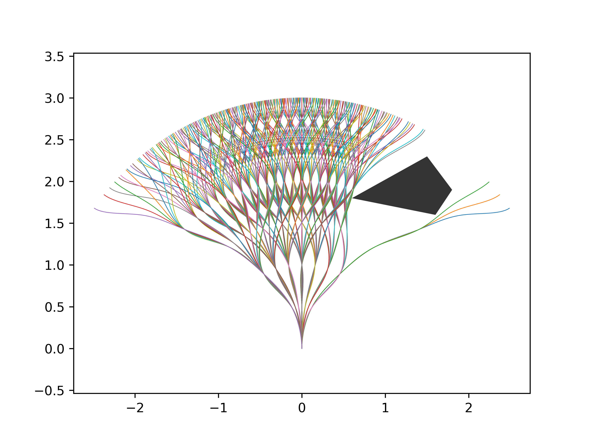

# PyPlanning

A python motion planning demo

## Global Planner

- 参考 Far-Planner，使用静态地图生成可视图，并使用 dijkstra 搜索最短路径
  - 以车体轮廓构造 kernel，对障碍物进行膨胀
  - 在膨胀后的地图中，构建障碍物轮廓，并使用多边形拟合
    - [tutorial_py_contours_begin](https://docs.opencv.org/4.7.0/d4/d73/tutorial_py_contours_begin.html)
    - [approxPolyDP](https://docs.opencv.org/4.7.0/d3/dc0/group__imgproc__shape.html)
- 可视图生成算法参考：https://tanergungor.blogspot.com/2015/04/robot-navigation-rotational-sweep.html

|              MAP 轮廓检测       |  生成可视图   |  搜索最短路径   |
|:------------------------------:|:---:|:---:|
|  |   |     |

## Local Planner

- 参考 CMU-LocalPlanner 生成轨迹算法，使用 Clamped Uniform B-Spline 表示轨迹
  - https://github.com/jizhang-cmu/ground_based_autonomy_basic
- 一些逻辑处理
  - Goal 在探索范围内时，将探索范围边界缩放到 Goal
  - 轨迹生成失败后，放大 `FOV` ，减小 `pathScale` 重新搜索
  - 算力优化
    - 在 `generate_paths` 主循环内只对航点及航点连线做避障检测（按车体宽度膨胀）
    - 生成轨迹簇后，对最优航点组生成 B 样条，进行 MINVO 避障检测
    - 注：凸包算法比较耗时

### BSplinePath

#### 拟合样条曲线

- 拟合时，给定等间距采样点，两端点的速度矢量
  - 《计算机辅助几何设计与非均匀有理 B 样条》
- 对于角度变化较大的航点，需要使用二次优化，同时优化平滑性和偏差代价
  - 平滑性：$\sum||(2*p_k - p_{k-1} - p_{k+1})||_2^2$
  - 偏差：$\sum ||M * q - wayPts_{ref}||_2^2$
  - 启发式分析局部支撑航点，添加半平面约束

|                    生成默认轨迹              |         调整扫掠角度 FOV=180 °               |   BSpline OSQP 拟合 |
|:------------------------------------------:|:------------------------------------------:|:-----:|
|   |  ||

#### BSplinePath Impl

- **MINVO 凸包**
  - 参考 MIT-MINVO / Mader 中的 MINVO，代替默认凸包进行避障检测
    - https://github.com/mit-acl/minvo
    - https://github.com/mit-acl/mader
  - 根据机器人形状膨胀凸包
    - 避障凸包示例中，机器人形状为边长 0.2 的正方形
    - 可以根据实际形状配置机器人轮廓点
- **弧长参数化**
  - 拟合默认参数 `u` 与弧长 `s` 之间的关系，实现对弧长的近似等间距采样 `u(s_eq)`
  - 弧长的近似计算采用 romberg 积分
- **轨迹动态更新** [WIP]
  - 动态移除已经行驶过的轨迹
  - 动态添加最新任务轨迹

|                 MINVO 凸包对比        |                    避障检测             |                  弧长参数化 - 等间隔采样                  |
|:-------------------------------------:|:---------------------------------------:|:-----------------------------------------------:|
|  |  |  |

|               MINVO 避障凸包膨胀               |            航点折线膨胀                    |       Local Planner 效果图        |
|:----------------------------------------:|:-------------------------------------------:|:------------------------------:|
|  |  |  |

## Speed Profile

## Path Follower

- PurePursuit
  - Kuwata, Yoshiaki, et al. "Motion planning in complex environments using closed-loop prediction." AIAA Guidance, Navigation and Control Conference and Exhibit. 2008.

## Simulator

- [ ] `arrive` 到点判断升级
