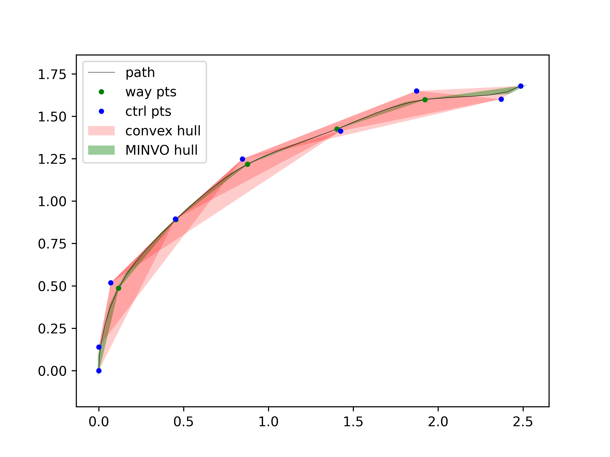
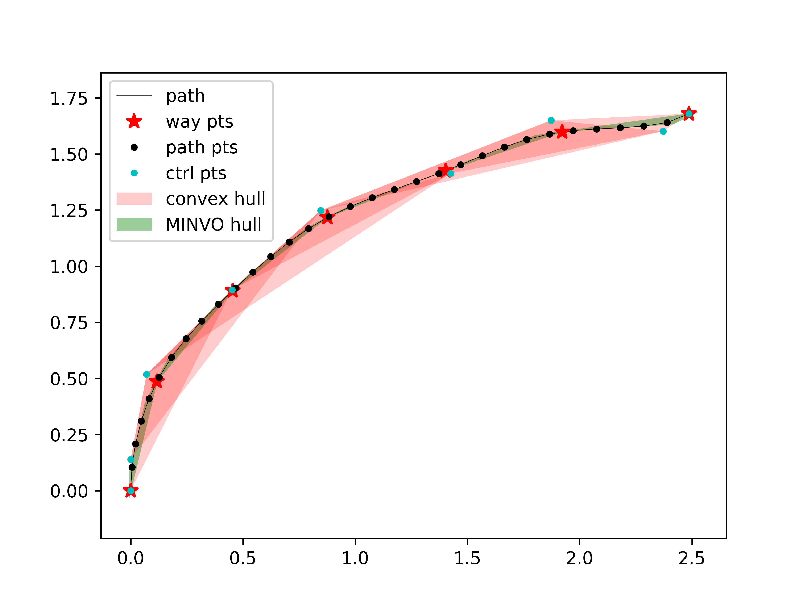

# PyPlanning

A python motion planning demo

## BSplinePath

#### 拟合样条曲线
- 参考 CMU-LocalPlanner 生成轨迹算法，使用 Clamped Uniform B-Spline 表示轨迹
  - https://github.com/jizhang-cmu/ground_based_autonomy_basic
- 拟合时，给定等间距采样点，两端点的速度矢量
  - 《计算机辅助几何设计与非均匀有理 B 样条》

|                    生成默认轨迹              |         调整扫掠角度 FOV=180 °               |
|----------------------------------------------|---------------------------------------------|
|   |  |

#### BSplinePath Impl
- **MINVO 凸包**
  - 参考 MIT-MINVO / Mader 中的 MINVO，代替默认凸包进行避障检测
    - https://github.com/mit-acl/minvo
    - https://github.com/mit-acl/mader
  - 根据机器人形状膨胀凸包
    - 避障凸包示例中，机器人形状为边长 0.2 的正方形
    - 可以根据实际形状配置机器人轮廓点
- **弧长参数化**
  - 拟合默认参数 `u` 与弧长 `s` 之间的关系，实现对弧长的近似等间距采样 `u(s_eq)`
  - 弧长的近似计算采用 romberg 积分
- **轨迹动态更新** [WIP]
  - 动态移除已经行驶过的轨迹
  - 动态添加最新任务轨迹

|                 MINVO 凸包对比        |                    避障检测             |                  弧长参数化 - 等间隔采样                  |
|:-------------------------------------:|:---------------------------------------:|:-----------------------------------------------:|
|  |  |  |

## Local Planner
- Goal 在探索范围内时，将探索范围边界缩放到 Goal
- 轨迹生成失败后，放大 `FOV` ，减小 `pathScale` 重新搜索
- 算力优化
  - 在 `generate_paths` 主循环内只对航点及航点连线做避障检测（按车体宽度膨胀）
  - 生成轨迹簇后，对最优航点组生成 B 样条，进行 MINVO 避障检测 
  - 注：凸包算法比较耗时

|              MINVO 避障凸包              |       Local Planner 效果图        |
|:----------------------------------------:|:------------------------------:|
|  |  |

## Speed Profile

## Path Follower
- PurePursuit

## Simulator
- [ ] `arrive` 到点判断升级
